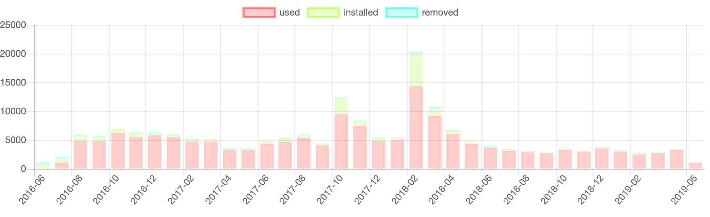

# Telegram Sticker Stats

A simple script to extract the usage of a Telegram sticker set as CSV that can be plotted.

Clone this repository, [register an application](https://telethon.readthedocs.io/en/latest/basic/signing-in.html#signing-in), copy `.env.example` to `.env` and fill in `API_ID` and `API_HASH`.

```bash
$ ./sticker.py name > name.csv
$
```


